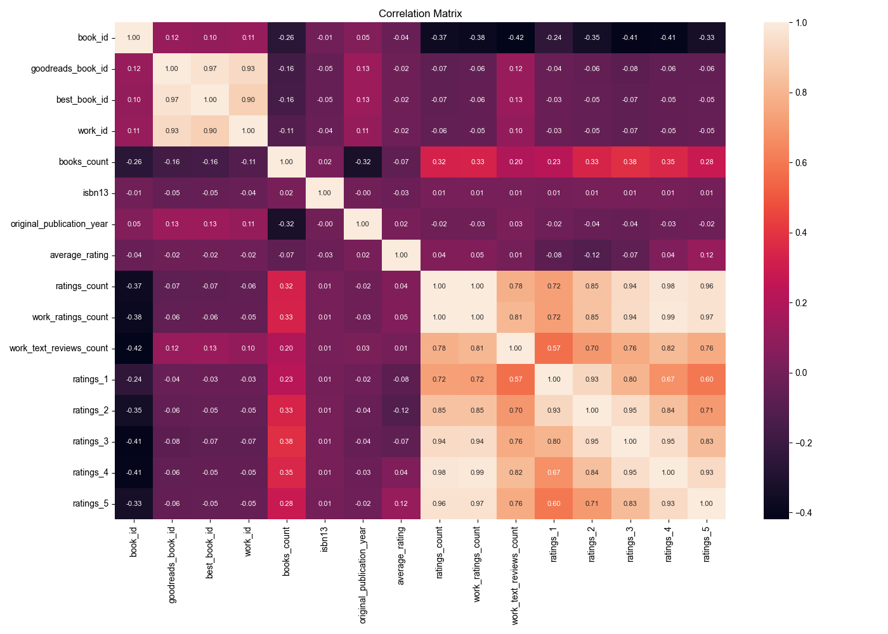

# Automated Analysis
## Summary Statistics
|        |   book_id |   goodreads_book_id |     best_book_id |         work_id |   books_count |         isbn |         isbn13 | authors      |   original_publication_year | original_title   | title          | language_code   |   average_rating |    ratings_count |   work_ratings_count |   work_text_reviews_count |   ratings_1 |   ratings_2 |   ratings_3 |      ratings_4 |       ratings_5 | image_url                                                                                | small_image_url                                                                        |
|:-------|----------:|--------------------:|-----------------:|----------------:|--------------:|-------------:|---------------:|:-------------|----------------------------:|:-----------------|:---------------|:----------------|-----------------:|-----------------:|---------------------:|--------------------------:|------------:|------------:|------------:|---------------:|----------------:|:-----------------------------------------------------------------------------------------|:---------------------------------------------------------------------------------------|
| count  |  10000    |     10000           |  10000           | 10000           |    10000      | 9300         | 9415           | 10000        |                    9979     | 9415             | 10000          | 8916            |     10000        |  10000           |      10000           |                  10000    |    10000    |    10000    |     10000   | 10000          | 10000           | 10000                                                                                    | 10000                                                                                  |
| unique |    nan    |       nan           |    nan           |   nan           |      nan      | 9300         |  nan           | 4664         |                     nan     | 9274             | 9964           | 25              |       nan        |    nan           |        nan           |                    nan    |      nan    |      nan    |       nan   |   nan          |   nan           | 6669                                                                                     | 6669                                                                                   |
| top    |    nan    |       nan           |    nan           |   nan           |      nan      |    3.757e+08 |  nan           | Stephen King |                     nan     |                  | Selected Poems | eng             |       nan        |    nan           |        nan           |                    nan    |      nan    |      nan    |       nan   |   nan          |   nan           | https://s.gr-assets.com/assets/nophoto/book/111x148-bcc042a9c91a29c1d680899eff700a03.png | https://s.gr-assets.com/assets/nophoto/book/50x75-a91bf249278a81aabab721ef782c4a74.png |
| freq   |    nan    |       nan           |    nan           |   nan           |      nan      |    1         |  nan           | 60           |                     nan     | 5                | 4              | 6341            |       nan        |    nan           |        nan           |                    nan    |      nan    |      nan    |       nan   |   nan          |   nan           | 3332                                                                                     | 3332                                                                                   |
| mean   |   5000.5  |         5.2647e+06  |      5.47121e+06 |     8.64618e+06 |       75.7127 |  nan         |    9.75504e+12 | nan          |                    1981.99  | nan              | nan            | nan             |         4.00219  |  54001.2         |      59687.3         |                   2919.96 |     1345.04 |     3110.89 |     11475.9 | 19965.7        | 23789.8         | nan                                                                                      | nan                                                                                    |
| std    |   2886.9  |         7.57546e+06 |      7.82733e+06 |     1.17511e+07 |      170.471  |  nan         |    4.42862e+11 | nan          |                     152.577 | nan              | nan            | nan             |         0.254427 | 157370           |     167804           |                   6124.38 |     6635.63 |     9717.12 |     28546.4 | 51447.4        | 79768.9         | nan                                                                                      | nan                                                                                    |
| min    |      1    |         1           |      1           |    87           |        1      |  nan         |    1.9517e+08  | nan          |                   -1750     | nan              | nan            | nan             |         2.47     |   2716           |       5510           |                      3    |       11    |       30    |       323   |   750          |   754           | nan                                                                                      | nan                                                                                    |
| 25%    |   2500.75 |     46275.8         |  47911.8         |     1.00884e+06 |       23      |  nan         |    9.78032e+12 | nan          |                    1990     | nan              | nan            | nan             |         3.85     |  13568.8         |      15438.8         |                    694    |      196    |      656    |      3112   |  5405.75       |  5334           | nan                                                                                      | nan                                                                                    |
| 50%    |   5000.5  |    394966           | 425124           |     2.71952e+06 |       40      |  nan         |    9.78045e+12 | nan          |                    2004     | nan              | nan            | nan             |         4.02     |  21155.5         |      23832.5         |                   1402    |      391    |     1163    |      4894   |  8269.5        |  8836           | nan                                                                                      | nan                                                                                    |
| 75%    |   7500.25 |         9.38223e+06 |      9.63611e+06 |     1.45177e+07 |       67      |  nan         |    9.78083e+12 | nan          |                    2011     | nan              | nan            | nan             |         4.18     |  41053.5         |      45915           |                   2744.25 |      885    |     2353.25 |      9287   | 16023.5        | 17304.5         | nan                                                                                      | nan                                                                                    |
| max    |  10000    |         3.32886e+07 |      3.55342e+07 |     5.63996e+07 |     3455      |  nan         |    9.79001e+12 | nan          |                    2017     | nan              | nan            | nan             |         4.82     |      4.78065e+06 |          4.94236e+06 |                 155254    |   456191    |   436802    |    793319   |     1.4813e+06 |     3.01154e+06 | nan                                                                                      | nan                                                                                    |
## Missing Values
|                           |    0 |
|:--------------------------|-----:|
| book_id                   |    0 |
| goodreads_book_id         |    0 |
| best_book_id              |    0 |
| work_id                   |    0 |
| books_count               |    0 |
| isbn                      |  700 |
| isbn13                    |  585 |
| authors                   |    0 |
| original_publication_year |   21 |
| original_title            |  585 |
| title                     |    0 |
| language_code             | 1084 |
| average_rating            |    0 |
| ratings_count             |    0 |
| work_ratings_count        |    0 |
| work_text_reviews_count   |    0 |
| ratings_1                 |    0 |
| ratings_2                 |    0 |
| ratings_3                 |    0 |
| ratings_4                 |    0 |
| ratings_5                 |    0 |
| image_url                 |    0 |
| small_image_url           |    0 |
## Correlation Matrix

## Analysis Story
### Insights from the Book Dataset Analysis

This dataset contains information about 10,000 books, providing an extensive overview of various attributes related to each title, including ratings, publication years, and author details. Below are the key insights derived from the summary statistics, missing values, and correlation matrix.

#### 1. **General Overview of the Dataset**
   - The dataset comprises 10,000 entries, with each entry representing a unique book.
   - Key identifiers, such as `book_id`, `goodreads_book_id`, and `best_book_id`, show a strong correlation, particularly between `goodreads_book_id` and `best_book_id` (correlation of 0.97). This suggests that these identifiers are closely linked, which may indicate that they serve similar purposes within the Goodreads ecosystem.

#### 2. **Missing Values Analysis**
   - Notable missing values are present in the `isbn` (700 missing), `isbn13` (585 missing), `original_publication_year` (21 missing), `original_title` (585 missing), and `language_code` (1,084 missing).
   - The high number of missing `isbn` and `isbn13` values could pose a challenge for any analysis involving book identification and categorization, as these fields are crucial for linking to external databases or systems.

#### 3. **Rating Distribution Insights**
   - The correlation between the various rating categories (`ratings_1` to `ratings_5`) is strong, particularly between `ratings_count`, `work_ratings_count`, and the specific ratings (e.g., `ratings_4` and `ratings_5` have a correlation of 0.93).
   - This suggests that books with higher overall ratings tend to receive more ratings overall. For example, an increase in `work_text_reviews_count` is inversely related to ratings, indicating that books with more reviews might receive slightly lower average ratings, potentially due to a higher volume of critical reviews.

#### 4. **Publication Year Trends**
   - The dataset includes some missing entries for `original_publication_year`, indicating that a small number of books lack publication dates. However, the presence of this column allows for potential time-series analysis of trends in book ratings over the years.
   - The correlation between `original_publication_year` and ratings is weak, suggesting that the age of the book does not significantly influence its ratings.

#### 5. **Language Diversity**
   - The `language_code` column has a substantial number of missing values (1,084), which may limit insights regarding language distribution. Understanding the language diversity of books can be crucial for targeted marketing or selection of books for specific audiences.

#### 6. **Average Ratings and Counts**
   - The average rating does not strongly correlate with the `ratings_count`. This may suggest that books with a high number of ratings do not necessarily have the highest average ratings, potentially indicating polarizing books that garner a lot of attention but also a mix of extreme reviews.

### Storytelling through Data

In the world of literature, each book has its own story, and our analysis helps illuminate the intricate patterns hidden within the numbers. Imagine a digital library bustling with readers, where 10,000 unique voices vie for attention. Some books, like old friends, have weathered the test of time, while others are new arrivals, still finding their footing. 

As we delve deeper, we notice that not all books are treated equally. The strong relationships among ratings suggest that popularity begets popularity; a book with a few glowing reviews can quickly become a sensation. Yet, the absence of certain identifiers raises questions about accessibility—how can a reader find their next favorite if the book's ISBN remains a mystery?

Our findings also reveal that the language of a book can be a barrier, with many titles lacking language identifiers. In an increasingly diverse reading landscape, understanding this aspect could enhance the experience for countless readers seeking stories in their native tongues.

Ultimately, this dataset is more than just numbers; it encapsulates the vibrant world of literature, where each statistic represents a reader's journey, a critic's perspective, a writer's dream. By unraveling these insights, we pave the way for deeper connections in the world of books, fostering a community where every title finds its reader.