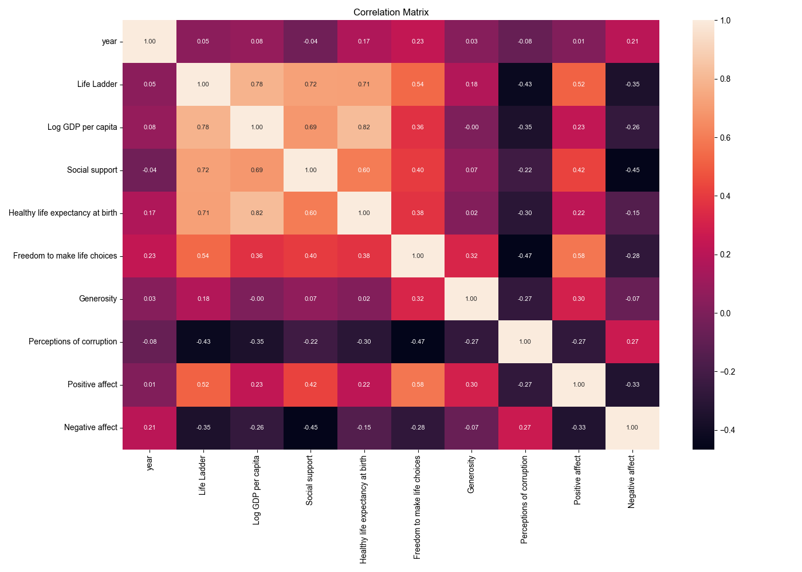

# Automated Analysis
## Summary Statistics
|        | Country name   |       year |   Life Ladder |   Log GDP per capita |   Social support |   Healthy life expectancy at birth |   Freedom to make life choices |     Generosity |   Perceptions of corruption |   Positive affect |   Negative affect |
|:-------|:---------------|-----------:|--------------:|---------------------:|-----------------:|-----------------------------------:|-------------------------------:|---------------:|----------------------------:|------------------:|------------------:|
| count  | 2363           | 2363       |    2363       |           2335       |      2350        |                         2300       |                    2327        | 2282           |                 2238        |       2339        |      2347         |
| unique | 165            |  nan       |     nan       |            nan       |       nan        |                          nan       |                     nan        |  nan           |                  nan        |        nan        |       nan         |
| top    | Argentina      |  nan       |     nan       |            nan       |       nan        |                          nan       |                     nan        |  nan           |                  nan        |        nan        |       nan         |
| freq   | 18             |  nan       |     nan       |            nan       |       nan        |                          nan       |                     nan        |  nan           |                  nan        |        nan        |       nan         |
| mean   | nan            | 2014.76    |       5.48357 |              9.39967 |         0.809369 |                           63.4018  |                       0.750282 |    9.77213e-05 |                    0.743971 |          0.651882 |         0.273151  |
| std    | nan            |    5.05944 |       1.12552 |              1.15207 |         0.121212 |                            6.84264 |                       0.139357 |    0.161388    |                    0.184865 |          0.10624  |         0.0871311 |
| min    | nan            | 2005       |       1.281   |              5.527   |         0.228    |                            6.72    |                       0.228    |   -0.34        |                    0.035    |          0.179    |         0.083     |
| 25%    | nan            | 2011       |       4.647   |              8.5065  |         0.744    |                           59.195   |                       0.661    |   -0.112       |                    0.687    |          0.572    |         0.209     |
| 50%    | nan            | 2015       |       5.449   |              9.503   |         0.8345   |                           65.1     |                       0.771    |   -0.022       |                    0.7985   |          0.663    |         0.262     |
| 75%    | nan            | 2019       |       6.3235  |             10.3925  |         0.904    |                           68.5525  |                       0.862    |    0.09375     |                    0.86775  |          0.737    |         0.326     |
| max    | nan            | 2023       |       8.019   |             11.676   |         0.987    |                           74.6     |                       0.985    |    0.7         |                    0.983    |          0.884    |         0.705     |
## Missing Values
|                                  |   0 |
|:---------------------------------|----:|
| Country name                     |   0 |
| year                             |   0 |
| Life Ladder                      |   0 |
| Log GDP per capita               |  28 |
| Social support                   |  13 |
| Healthy life expectancy at birth |  63 |
| Freedom to make life choices     |  36 |
| Generosity                       |  81 |
| Perceptions of corruption        | 125 |
| Positive affect                  |  24 |
| Negative affect                  |  16 |
## Correlation Matrix

## Analysis Story
### Story: Understanding Well-Being Across Countries

In our analysis of well-being metrics across 165 countries from 2005 to 2023, we sought to uncover the relationships between various socio-economic factors and the emotional states of individuals, as indicated by measures of positive and negative affect. With a dataset comprising 2,363 observations, we found several interesting insights that shed light on the dynamics of happiness and life satisfaction globally.

#### Dataset Overview

The dataset includes key indicators such as the Life Ladder, Log GDP per capita, Social Support, Healthy Life Expectancy at Birth, Freedom to Make Life Choices, Generosity, and Perceptions of Corruption. The dimensions of positive and negative affect provide a window into the emotional well-being of individuals in different countries. 

Despite having a robust dataset, we noted some missing values, particularly in Log GDP per capita (28), Social Support (13), Healthy Life Expectancy at Birth (63), Freedom to Make Life Choices (36), Generosity (81), Perceptions of Corruption (125), Positive Affect (24), and Negative Affect (16). These gaps present an opportunity for further data collection and analysis to enhance the insights drawn.

#### Emotional Well-Being

The mean scores for positive and negative affect were 0.6519 and 0.2732, respectively, indicating that, on average, individuals reported higher levels of positive emotions than negative. This could be a testament to the resilience of individuals in the face of adversity or the influence of cultural factors that promote positivity.

#### Key Correlations

Our correlation analysis revealed several noteworthy relationships between well-being indicators:

1. **Year and Emotional States**: The year had a positive correlation with negative affect (0.2076), suggesting that either external factors or changing societal conditions may be contributing to increasing feelings of negativity over time. Conversely, the correlation with positive affect was negligible (0.0131), indicating that positive emotions have remained relatively stable despite the passage of time.

2. **Life Ladder and Affects**: The Life Ladder, a measure of overall life satisfaction, was positively correlated with positive affect (0.0468) and negatively correlated with negative affect (-0.3524). This reinforces the idea that higher overall life satisfaction is associated with more positive feelings and fewer negative emotions.

3. **Economic Factors**: Log GDP per capita showed weak correlations with both positive affect (0.0801) and negative affect (-0.2607). While economic prosperity does not directly translate to emotional well-being, the negative relationship with negative affect suggests that wealth may help mitigate feelings of distress.

4. **Social Support and Emotional Health**: The correlation of social support with negative affect was notably strong (-0.4549), indicating that robust social networks can play a critical role in reducing feelings of negativity. This finding highlights the importance of community and relationships in enhancing emotional well-being.

5. **Freedom and Well-Being**: Freedom to make life choices had a positive correlation with positive affect (0.2329) and a negative correlation with negative affect (-0.2789). This suggests that greater autonomy in decision-making correlates with higher levels of happiness and lower levels of distress.

6. **Perceptions of Corruption**: Interestingly, perceptions of corruption were positively correlated with negative affect (0.2656) and negatively correlated with positive affect (-0.3345). This indicates that living in a corrupt environment can significantly dampen emotional well-being, reinforcing the need for transparency and integrity in governance.

#### Conclusion

Our analysis of well-being across countries reveals a complex interplay between socio-economic factors and emotional states. While positive affect tends to prevail, there are significant challenges reflected in the increasing negative affect over time, particularly in light of economic and social factors. The importance of social support, freedom, and the impact of corruption cannot be overstated as they play crucial roles in shaping the emotional landscape of individuals.

As we move forward, addressing these key areas could lead to improved well-being and happiness for individuals across the globe. Policymakers should focus on enhancing social support systems, promoting freedom of choice, and combating corruption to foster a healthier, happier society.