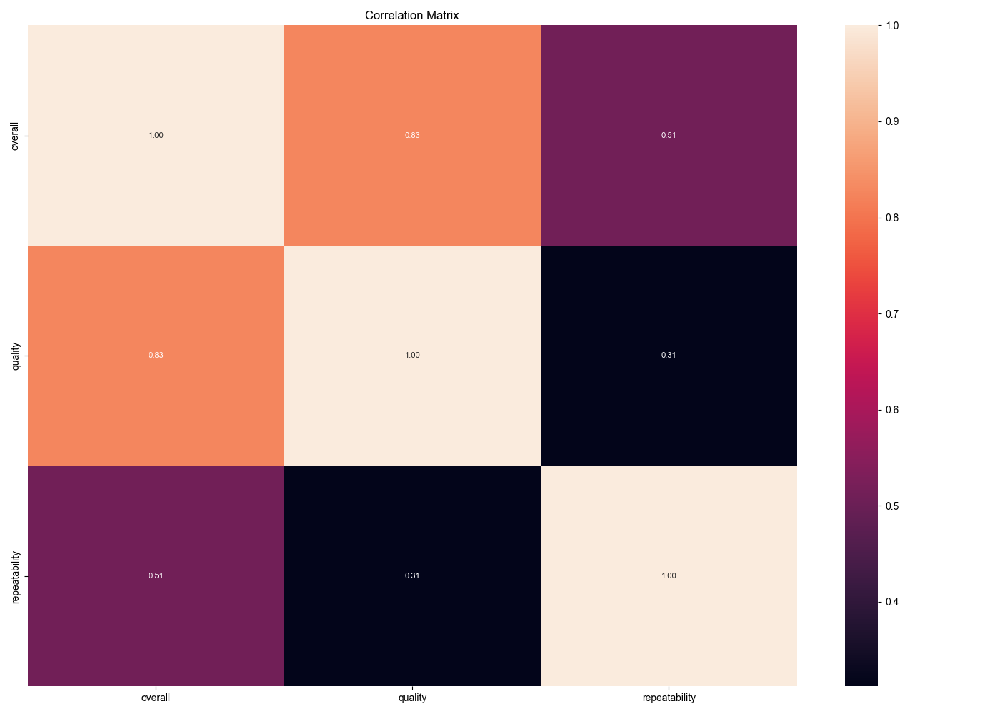

# Automated Analysis
## Summary Statistics
|        | date      | language   | type   | title             | by                |    overall |     quality |   repeatability |
|:-------|:----------|:-----------|:-------|:------------------|:------------------|-----------:|------------:|----------------:|
| count  | 2553      | 2652       | 2652   | 2652              | 2390              | 2652       | 2652        |     2652        |
| unique | 2055      | 11         | 8      | 2312              | 1528              |  nan       |  nan        |      nan        |
| top    | 21-May-06 | English    | movie  | Kanda Naal Mudhal | Kiefer Sutherland |  nan       |  nan        |      nan        |
| freq   | 8         | 1306       | 2211   | 9                 | 48                |  nan       |  nan        |      nan        |
| mean   | nan       | nan        | nan    | nan               | nan               |    3.04751 |    3.20928  |        1.49472  |
| std    | nan       | nan        | nan    | nan               | nan               |    0.76218 |    0.796743 |        0.598289 |
| min    | nan       | nan        | nan    | nan               | nan               |    1       |    1        |        1        |
| 25%    | nan       | nan        | nan    | nan               | nan               |    3       |    3        |        1        |
| 50%    | nan       | nan        | nan    | nan               | nan               |    3       |    3        |        1        |
| 75%    | nan       | nan        | nan    | nan               | nan               |    3       |    4        |        2        |
| max    | nan       | nan        | nan    | nan               | nan               |    5       |    5        |        3        |
## Missing Values
|               |   0 |
|:--------------|----:|
| date          |  99 |
| language      |   0 |
| type          |   0 |
| title         |   0 |
| by            | 262 |
| overall       |   0 |
| quality       |   0 |
| repeatability |   0 |
## Correlation Matrix

## Analysis Story
### Key Insights and Analysis Story

#### Overview of the Dataset
The dataset consists of 2,652 entries and captures various metrics related to a collection of movies, likely focusing on viewer feedback or ratings. Key attributes include the date of the entry, language, type of media, and quality metrics (overall rating, quality, and repeatability). The dataset has some missing values, particularly in the 'date' (99 missing) and 'by' (262 missing) columns, which may limit a full temporal analysis or an understanding of the reviewers' backgrounds.

#### Summary Statistics
1. **Temporal Distribution**: The dataset spans multiple years, with the most frequently occurring date being May 21, 2006. This could indicate a peak in data collection or viewing activity around that time.
  
2. **Language Diversity**: There are 11 unique languages represented in the dataset, with English being the most prominent language (1,306 entries). This suggests a strong focus on English-language films, potentially skewing the overall quality ratings towards this demographic.

3. **Types of Media**: The 'type' column indicates 8 different categories, with 'movie' being the most frequent (2,211 entries). This aligns with the overall theme of the dataset, as it seems to primarily focus on films.

#### Quality Metrics
- **Overall Ratings**: The average overall rating is approximately 3.05, suggesting a moderately positive sentiment from viewers, with most ratings clustered between 1 and 5.
- **Quality Ratings**: The average quality rating is slightly higher at 3.21, which indicates that while viewers are generally satisfied, there is room for improvement in how quality is perceived.
- **Repeatability**: The average repeatability score is 1.49, indicating that many viewers might not find the films worth re-watching, which could hint at issues with engagement or lasting impact.

#### Missing Values
The presence of missing values, particularly in the 'date' and 'by' fields, may affect certain analyses. The missing dates could prevent a full temporal analysis of trends over time, while the missing 'by' data limits insights into the demographics of reviewers. It may be worthwhile to investigate the missing data further to understand any patterns (e.g., were certain types of movies reviewed more frequently than others?).

#### Correlation Insights
The correlation matrix reveals significant relationships between the quality metrics:
- A strong positive correlation (0.83) exists between overall ratings and quality, indicating that viewers who rate a film highly on one metric tend to rate it similarly on the other.
- There is a moderate positive correlation (0.51) between overall ratings and repeatability, suggesting that films rated higher are also more likely to be considered rewatchable.
- The relationship between quality and repeatability is weaker (0.31), implying that quality alone does not necessarily dictate whether a viewer would choose to rewatch a film.

#### Story Conclusion
In conclusion, this dataset paints a picture of viewer sentiment towards movies, emphasizing the importance of overall enjoyment and perceived quality. While the overall ratings are moderately positive, the lower repeatability score suggests that many films may lack the compelling nature needed to encourage rewatching. 

The analysis also indicates a significant focus on English-language films, which could influence the generalizability of the findings to a broader audience. The presence of missing values and potential limitations in the dataset highlights the need for further investigation, particularly in understanding viewer demographics and temporal trends. 

Future work could involve addressing the missing data, exploring viewer demographics, and assessing whether certain types of movies perform better in terms of viewer engagement and repeatability. This could provide more actionable insights for filmmakers and marketers aiming to enhance viewer retention and satisfaction.